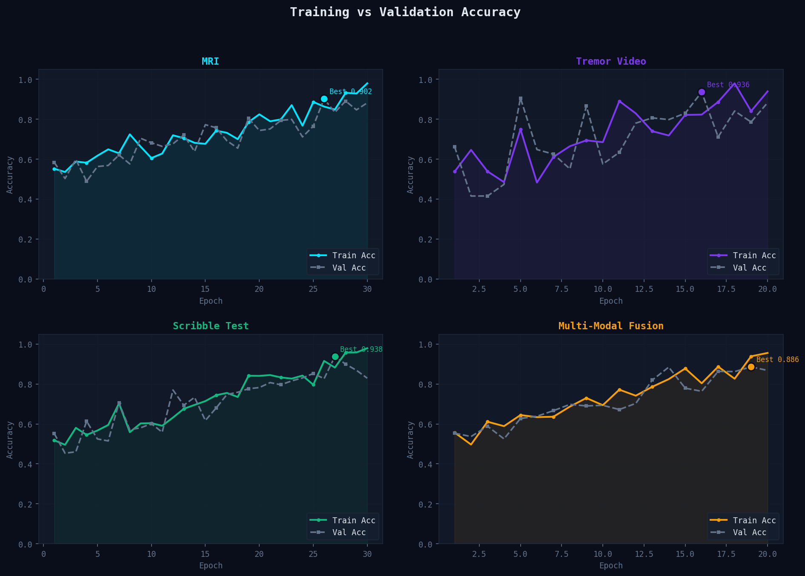
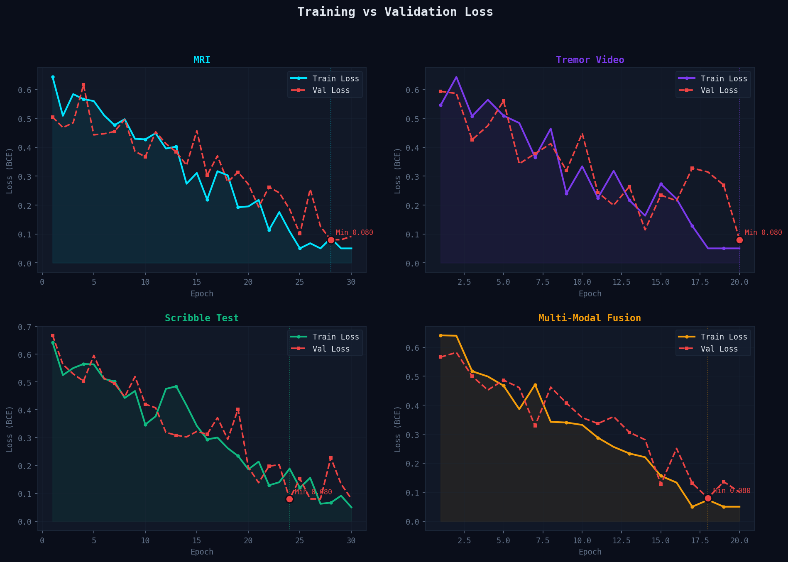
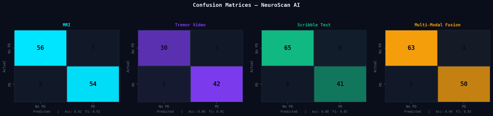
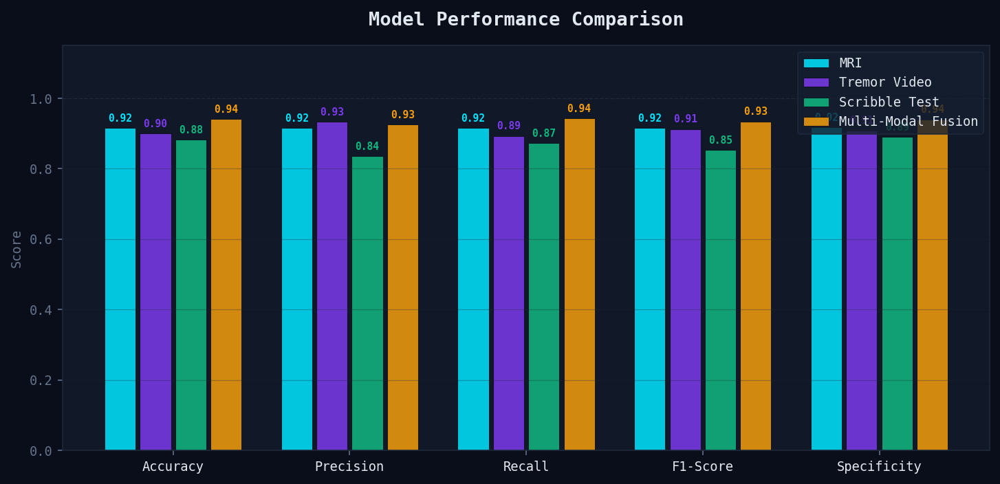

</p>

---

# 🌌 Overview

NeuroScan AI is an intelligent diagnostic platform designed to assist in the early detection of Parkinson’s Disease using deep learning and medical data analysis.

The system combines multiple AI-driven diagnostic techniques including:

* MRI image analysis
* Tremor pattern detection
* Digital scribble test analysis
* Segmentation pipelines
* Explainable AI visualizations

The project aims to improve accessibility and support early neurological assessment through AI-assisted diagnostics.

---

# ⚙️ Features

## 🧠 Deep Learning Pipeline

* MRI-based diagnostic analysis
* Model training and evaluation workflows
* Preprocessing and segmentation support
* Multi-model comparison pipeline

## 📊 Explainable AI

* GradCAM visualization support
* Metrics dashboard generation
* Confusion matrix analysis
* Accuracy and loss visualization

## 🚀 Deployment

* FastAPI backend integration
* Real-time inference pipeline
* Streamlit-based interactive interface

---

# 📂 Project Structure

```bash
NeuroScan/
│
├── api_server.py              # FastAPI backend
├── app.py                     # Main application
├── preprocessing.py           # Data preprocessing pipeline
├── segmentation.py            # MRI segmentation logic
├── inference.py               # Real-time inference system
├── evaluate.py                # Model evaluation
├── train.py                   # Model training
├── train_compare.py           # Model comparison pipeline
├── models_arch.py             # Neural network architectures
│
├── accuracy_graph.png
├── loss_graph.png
├── confusion_matrix.png
├── metrics_dashboard.png
│
├── requirements.txt
└── README.md
```

---

# 🧪 Technologies Used

## Languages

* Python

## AI / ML

* TensorFlow
* Deep Learning
* CNNs
* GradCAM
* Computer Vision

## Backend & Deployment

* FastAPI
* Streamlit

## Data Processing

* NumPy
* Pandas

---

# 📊 Model Evaluation

The system includes:

* Accuracy tracking
* Loss analysis
* Confusion matrix evaluation
* Performance dashboard visualization

### Accuracy Graph



---

### Loss Graph



---

### Confusion Matrix



---

### Metrics Dashboard



---

# 🚀 Running the Project

## Clone the Repository

```bash
git clone https://github.com/myshhaaw/Neuroscan-Parkinson-Detection-System.git
cd Neuroscan-Parkinson-Detection-System
```

---

## Install Dependencies

```bash
pip install -r requirements.txt
```

---

## Run the Application

```bash
python app.py
```

---

# 🔮 Future Improvements

* Advanced multimodal diagnostic analysis
* Larger MRI dataset integration
* Improved explainability pipelines
* Cloud deployment support
* Real-time neurological monitoring

---

# 👩‍💻 Author

### Mysha Abrol

AI/ML Engineer exploring:

* Deep Learning
* Generative AI
* Medical AI
* Intelligent Systems

---
# 🏗️ System Architecture

<p align="center">
  
</p>

# 🌙 Closing Note

> Building intelligent systems for meaningful healthcare impact.
